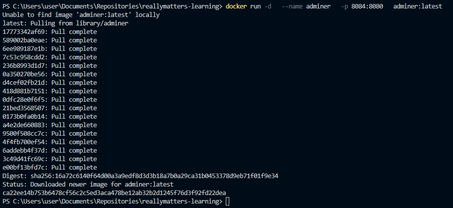
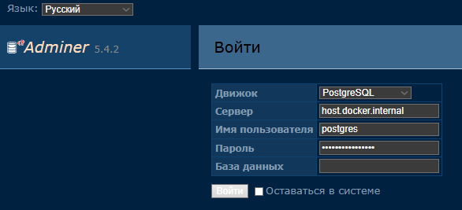
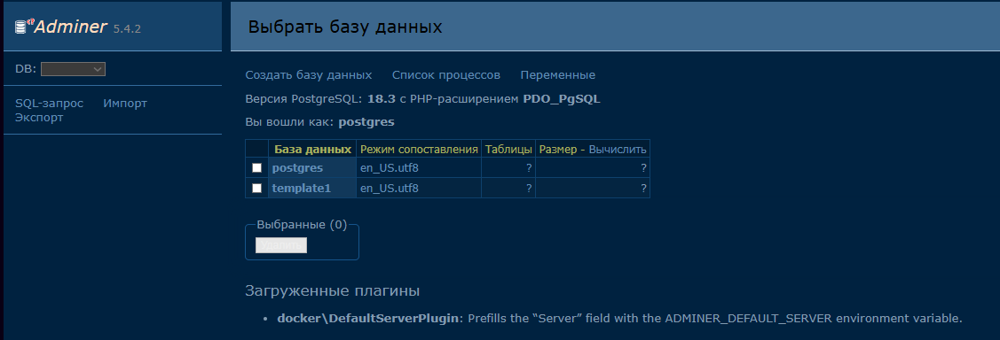

# Самостоятельная работа по Информационным технологиям, Docker: Adminer

## 1. Установка и запуск Adminer для управления БД:

### 

## 2. Заход на сайт и введение данных:
### 

## 3. Выбор БД, после введения данных:
### 