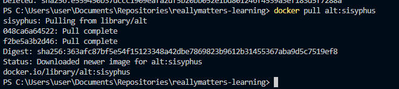
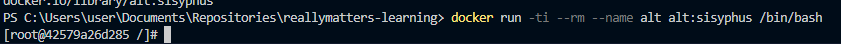
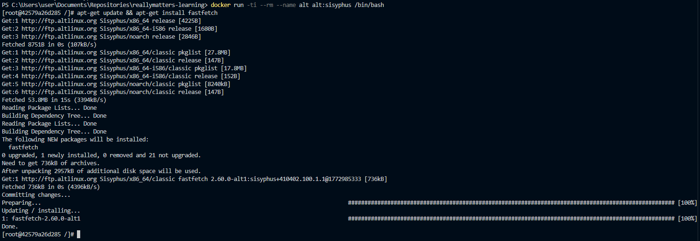
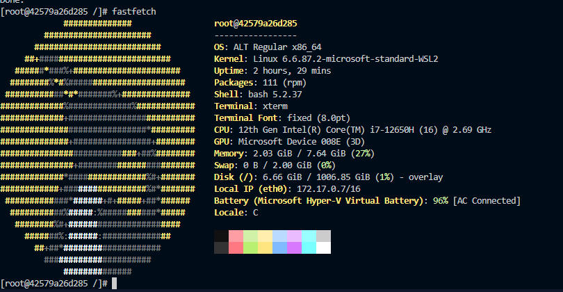

# Самостоятельная работа по Информационным технологиям, Docker: Alt Linux in Docker

## 1. Загрузка готового образа Alt:

## 2. Запуск и его использование:

## 3. Установка приложения fastfetch в контейнере:

## 4. Запуск fastfetch:
