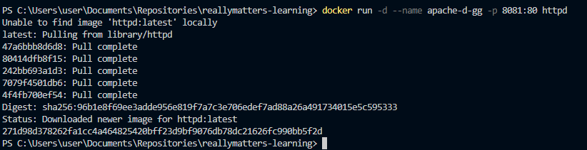
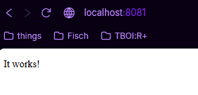
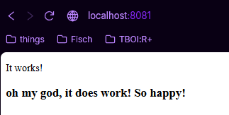

# Самостоятельная работа по Информационным технологиям, Docker: Apache

## 1. Получение образа, создание и запуск контейнера:
### 
## 2. Работа страницы http://localhost:8081:
### 
## 3. Редактирование этой веб-страницы:
### 