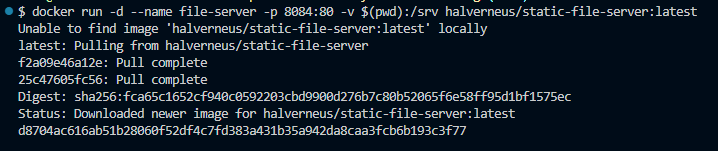
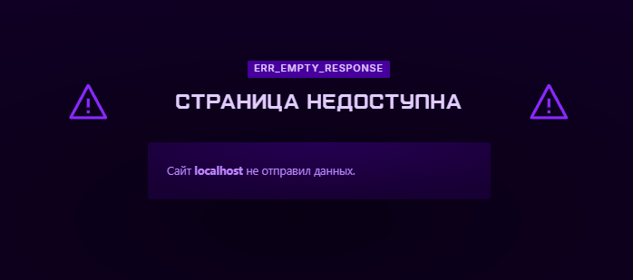

# Самостоятельная работа по Информационным технологиям, Docker: File Server

## 1. Запуск simple-http-server для раздачи файлов:

## 2. Сам вебсайт по ссылке localhost:8084(но он выдаст ошибку, т.к. демонстрационный стенд):

