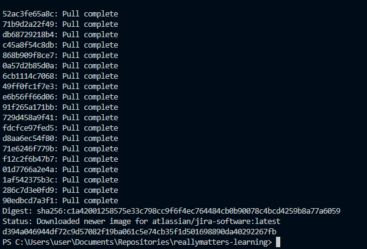
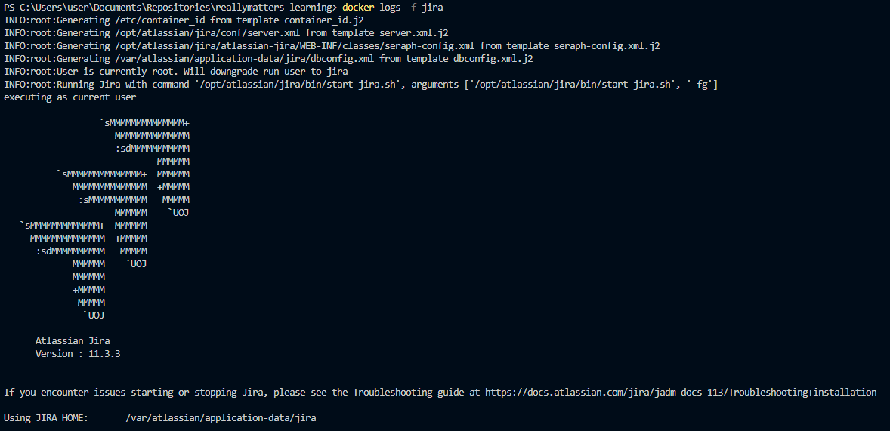
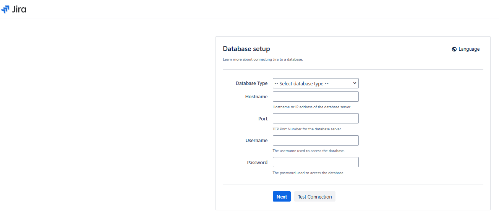

# Самостоятельная работа по Информационным технологиям, Docker: Jira

## 1. Загрузка образа, создание и запуск контейнера:
### 

## 2. Запуск лог Jira для наблюдением за процессом подготовки приложения:
### 

## 3. Jira Website:
### 