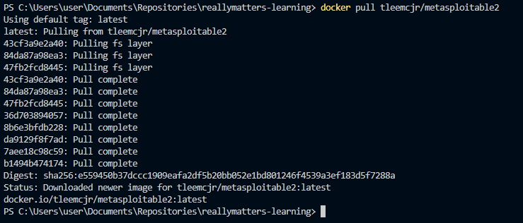
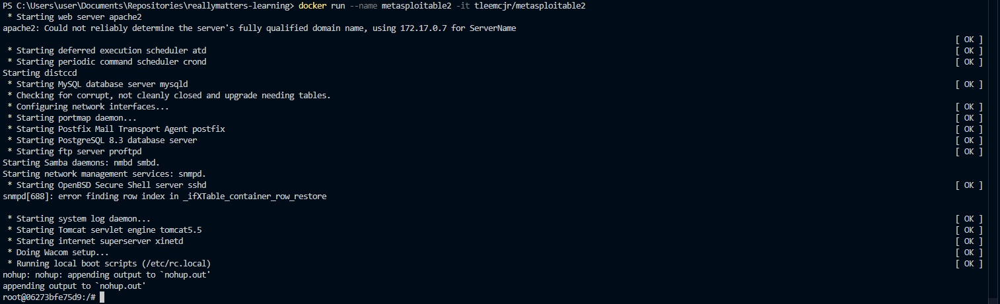
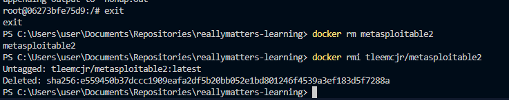

# Самостоятельная работа по Информационным технологиям, Docker: Metasploitable2 Docker

## 1. Установить докер-образ:
### 

## 2. Загрузка образа, создание и запуск контейнера:
### 

## 3. Выход из контейнера и его удаление, а также удаление его образа:
### 