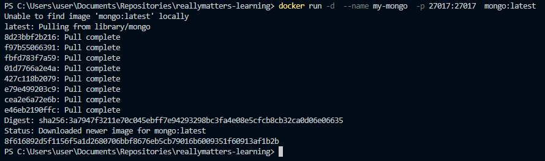
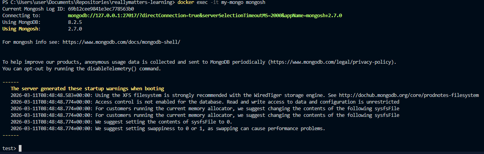
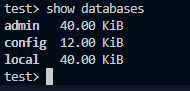
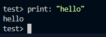

# Самостоятельная работа по Информационным технологиям, Docker: MongoDB(NoSQL)

## 1. Запуск MongoDB:
### 

## 2. Подключение через Shell:
### 

## 3. Выполнение несколько команд в этой БД:
### 3.1. show databases:
### 

### 3.2. print:
### 