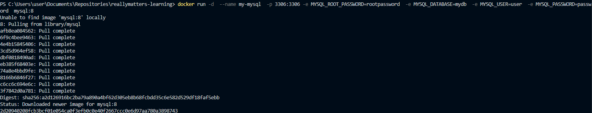
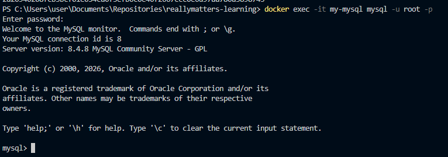
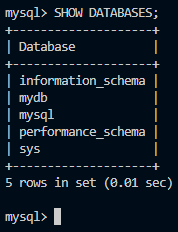
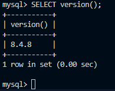

# Самостоятельная работа по Информационным технологиям, Docker: MySQL

## 1. Запуск MySQL:
### 

## 2. Подключение к серверу:
### 

## 3. Выполнение несколько демонстрационных команд:
### 3.1 Получение списка баз данных:
### 

### 3.2 Получение версии:
### 