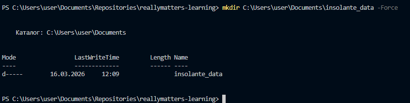
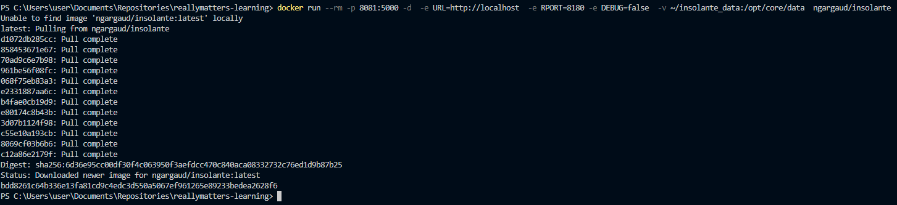
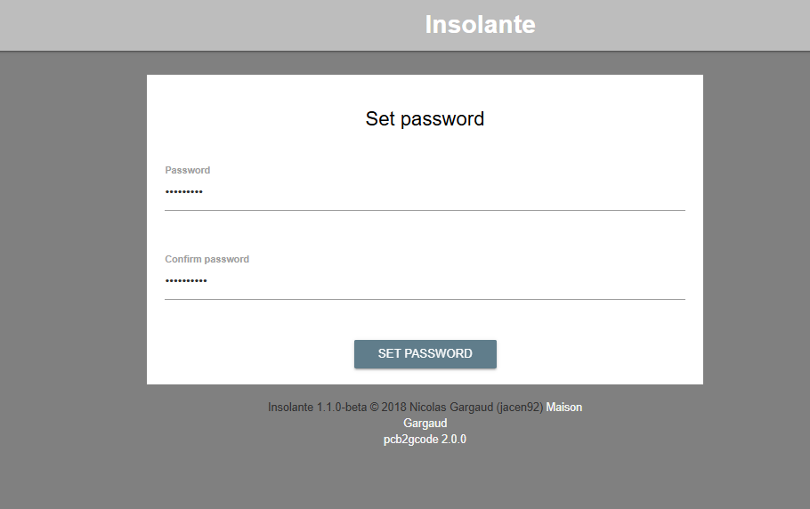
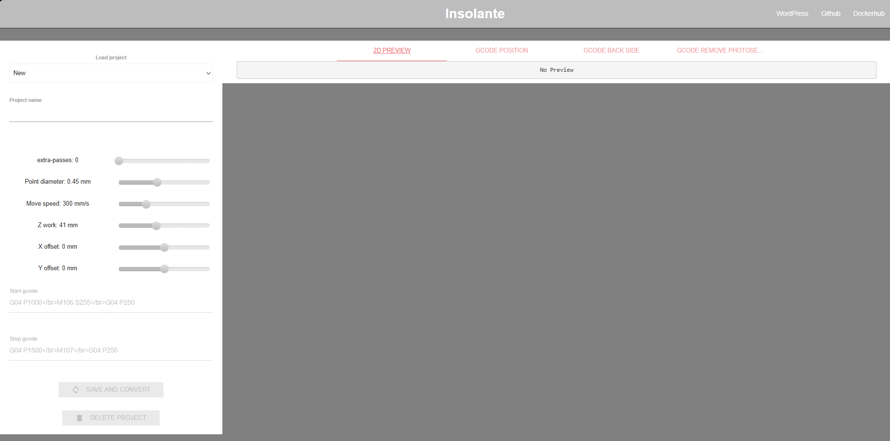

# Самостоятельная работа по Информационным технологиям, Docker: Pcb2gcode

## 1. Создаём папку для данных (если её нет):
### 

## 2. Загружаем образ, создаём и запускаем контейнер:
### 

## 3. Website insolante и ввод пароля в нём:
### 

## 4. Вход в админ-панель:
### 