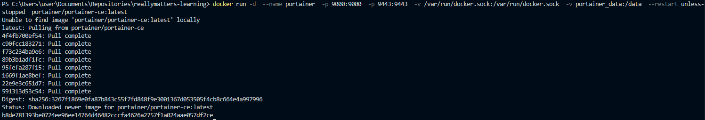
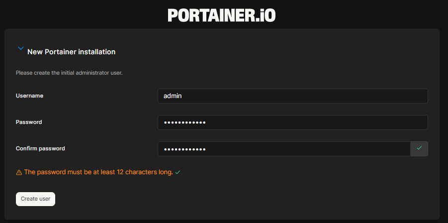
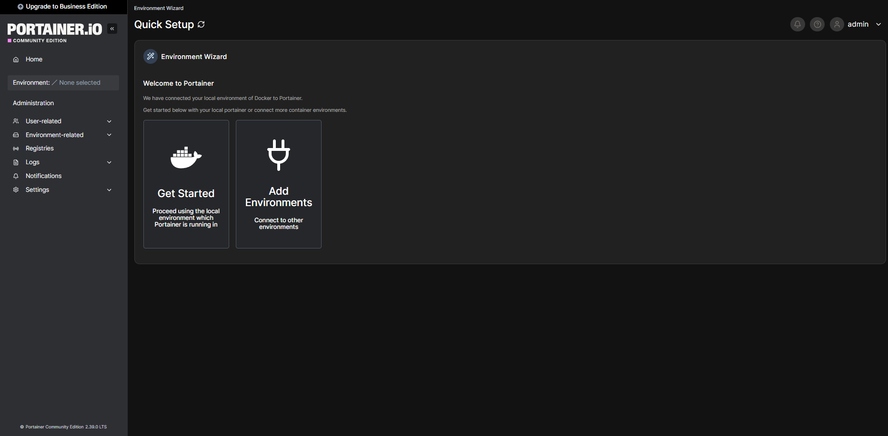
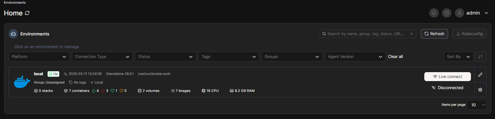

# Самостоятельная работа по Информационным технологиям, Docker: Portainer

## 1. Ввод длинной команды(связано с томами):
### 

## 2. Создание аккаунта и вход:
### 
### 

## 3. Возможности внутри Home:
### 
