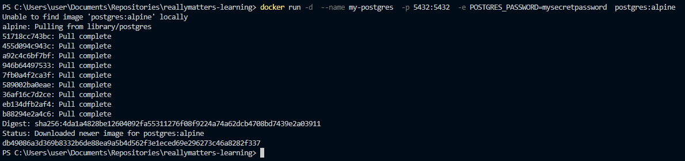
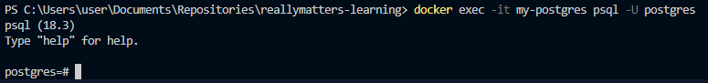
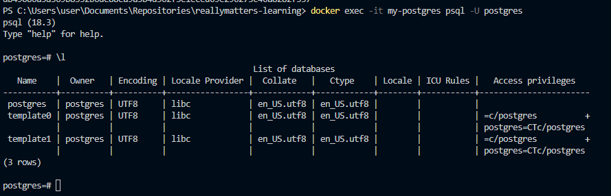
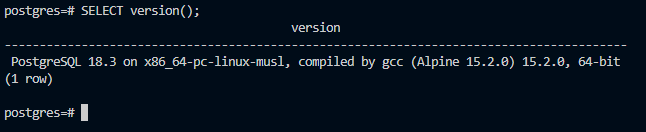

# Самостоятельная работа по Информационным технологиям, Docker: PostgreSQL

## 1. Запуск PostgreSQL с паролем:
### 

## 2. Подключение через psql:
### 

## 3. Выполнение несколько демонстрационных команд:
### 3.1. Получение списка баз данных:
### 
### 3.2. Получение версии:
### 