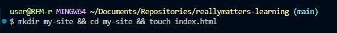
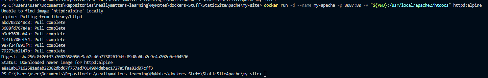

# Самостоятельная работа по Информационным технологиям, Docker: Static Website on Apache

## 1. Создать папку с HTML файлом в папке Docker-проектов:
### 

## 2. Находясь в папке проекта my-site, выполнить загрузку образа, создание контейнера с сервером и его запуск:
### 

## 3. Как выглядит статичный запущенный сайт нa Apache, с введённым ранее - echo "Hello, Docker!":
### 