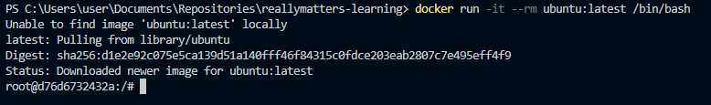
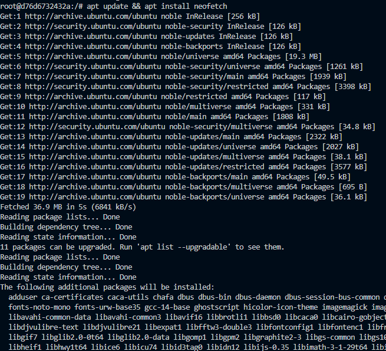
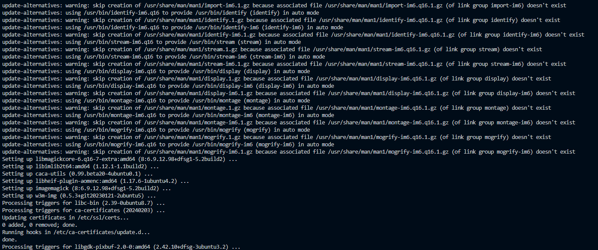

# Самостоятельная работа по Информационным технологиям, Docker: Ubuntu

## 1. Загрузка, запуск и вход во временный Ubuntu контейнер:
### 

## 2. Установка что-нибудь внутрь(например, neofetch):
#### Начало скачивания:
### 
#### Конец:
### 
