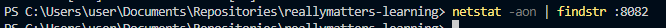
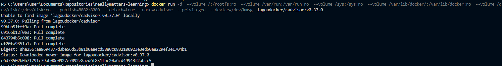
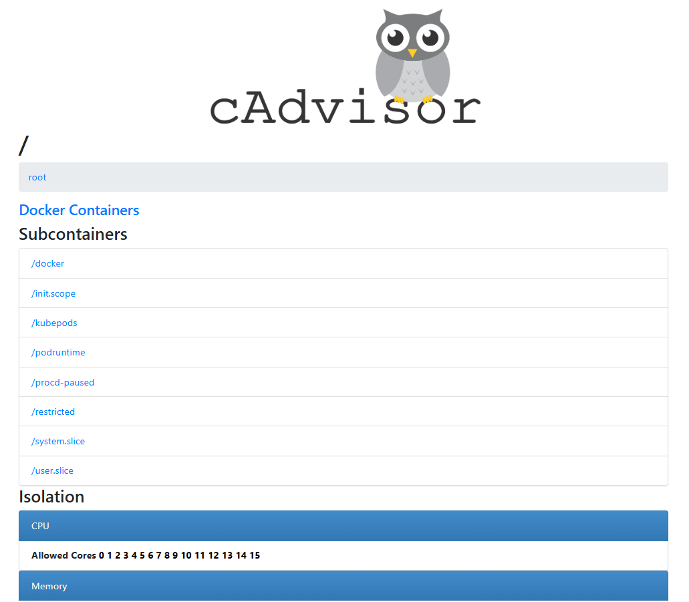

# Самостоятельная работа по Информационным технологиям, Docker: cAdvisor

## 1. Проверка доступности порта 8082:
### 

## 2. Загрузка, создание и запуск контейнера с cAdvisor:
### 

## 3. Сайт, по ссылке: http://localhost:8082:
### 