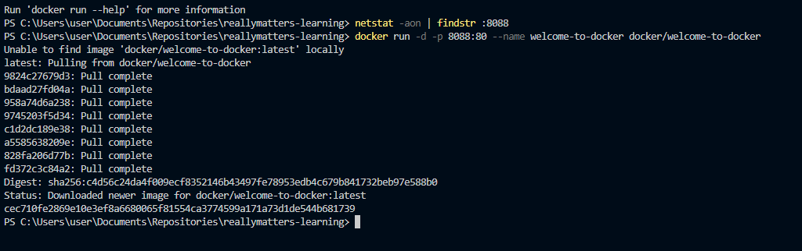
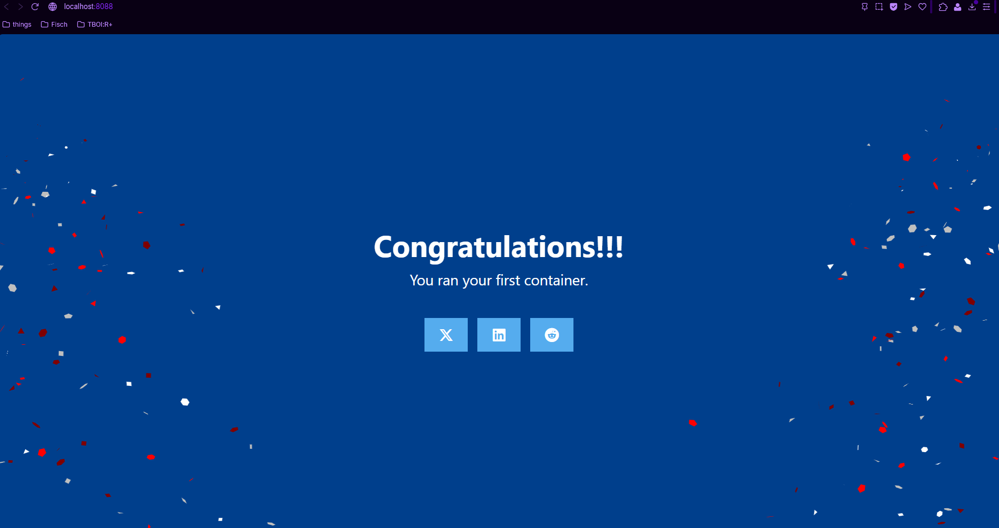
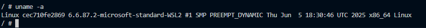
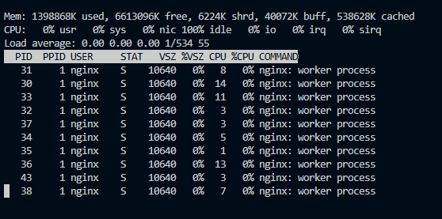
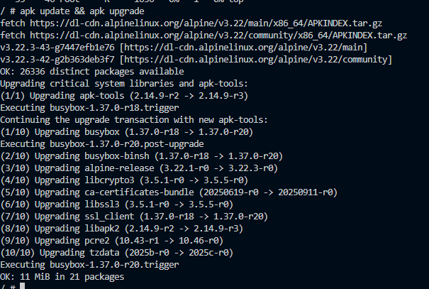
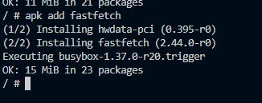
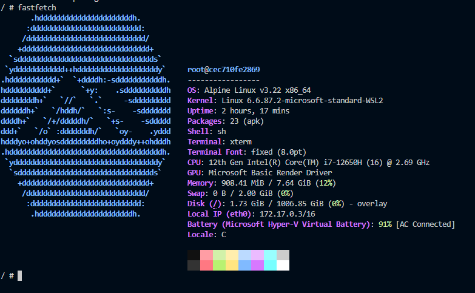

# Самостоятельная работа по Информационным технологиям, Docker
## Проверка айпи и создание образа:
### 
## Как выглядит страница, по адресу: http://localhost:8088 :
### 
## Команда uname -a:
### 
## Команда top:
### 
## Обновление источников приложений:
### 
## Установление приложения:
### 
## И его запуск:
### 